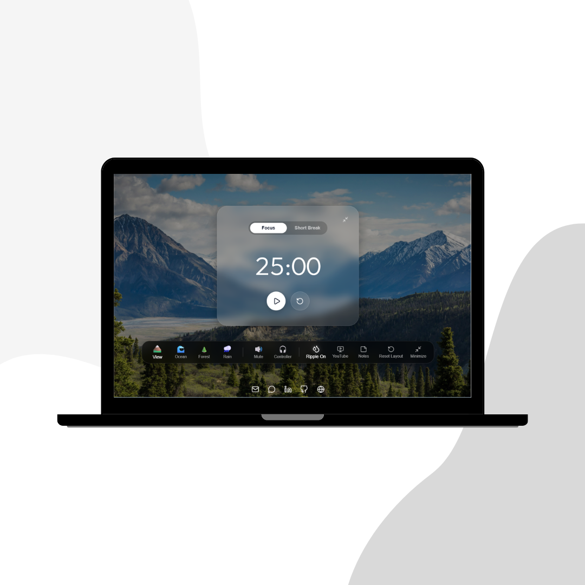

# AuraLeaf

AuraLeaf is a heartfelt React app designed as a birthday gift experience and a calming study companion. A peaceful focus environment featuring ambient sounds, a timer, and a soft, welcoming interface.


## ✨ Features

- Relaxing ambient sound scenes such as mountain wind, ocean waves, forest birds, and rain
- Study timer and focus-friendly controls
- Clean, modern UI built with React
- **New:** Interactive Sticky Notes widget for quick thoughts
- **New:** YouTube Widget for integrated video and music playback
- **New:** Draggable Docked Interface Layout for a highly customizable workspace
- **New:** Stunning Viscous Liquid Effect animations

## 🛠️ Tech Stack

- React
- JavaScript
- CSS
- Lucide React icons
- HTML5 audio for ambient sound playback

## 🌐 Deployment

Live demo: https://auraleaf.vercel.app/

## ▶️ Getting Started

1. Install dependencies:
   ```bash
   npm install
   ```

2. Start the development server:
   ```bash
   npm start
   ```

3. Open http://localhost:3000 in your browser.

## 📁 Project Structure

- src/components - Main app UI sections such as study mode, timer, noise controls, and new widgets
- src/hooks - Custom hooks for interaction logic
- src/assets/sounds - Ambient audio files

