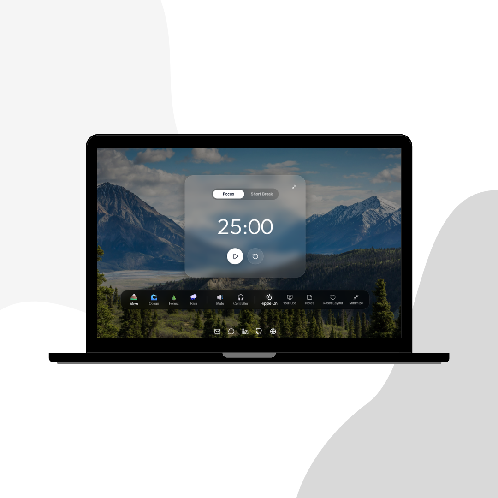

# AuraLeaf 🍃

AuraLeaf is a beautifully crafted, immersive study companion and ambient focus environment. Originally conceived as a heartfelt birthday gift experience, it has evolved into a fully-fledged productivity tool designed to create a peaceful and customizable workspace.



## ✨ Key Features
- **Ambient Soundscapes:** Immerse yourself in high-quality background noises including Mountain Wind, Ocean Waves, Forest Birds, and Rain.
- **Focus Timer:** Built-in Pomodoro-style study timer to keep track of your work sessions.
- **Draggable Workspace:** Highly customizable, dock-based interface. Move widgets around freely to suit your layout preferences (powered by `react-draggable`).
- **Interactive Widgets:**
  - **Sticky Notes:** Quickly jot down thoughts and to-dos without leaving the app.
  - **Media Player:** Integrated YouTube player (`react-player`) for your favorite study playlists or lofi beats.
- **Immersive UI/UX:**
  - Stunning viscous liquid ripple effects (using `jquery.ripples`).
  - Clean, modern, glassmorphism-inspired design.
  - Responsive layouts driven by Tailwind CSS.

## 🚀 Live Demo
Experience AuraLeaf live: [auraleaf.vercel.app](https://auraleaf.vercel.app/)

## 🛠️ Tech Stack & Technologies
- **Frontend:** React 19, JavaScript, HTML5, CSS3
- **Styling:** Tailwind CSS (v4), Autoprefixer, PostCSS
- **State Management & UI:** Custom React Hooks
- **Key Libraries:** 
  - `react-draggable` for floating windows
  - `react-player` for seamless video integration
  - `lucide-react` for beautiful iconography
  - `jquery.ripples` for interactive water animations

## 📦 Getting Started

### Prerequisites
- Node.js (v18+ recommended)
- npm or yarn

### Installation
1. Clone the repository:
   ```bash
   git clone https://github.com/nadiahossny/AuraLeaf.git
   ```
2. Navigate to the project directory:
   ```bash
   cd auraleaf
   ```
3. Install dependencies:
   ```bash
   npm install
   ```

### Running for Development
Start the local development server:
```bash
npm start
```
The app will be available at `http://localhost:3000`.

### Building for Production
To generate a production-ready build:
```bash
npm run build
```
The optimized files will be generated in the `build/` folder.

## 📁 Project Architecture
```text
src/
├── assets/          # Images, icons, and audio files
├── components/      # Reusable React components (Widgets, Timer, Controls)
├── hooks/           # Custom React hooks for interaction logic
├── index.css        # Global styles and Tailwind configuration
├── App.jsx          # Main application container
└── index.js         # React entry point
```

## 🤝 Contributing
Contributions, issues, and feature requests are welcome! Feel free to check the issues page if you want to contribute.

## 📄 License
This project is for personal and educational use.
